    <picture>
<source 
  srcset="./profile/stats-dark.svg"
  media="(prefers-color-scheme: dark)"
/>
<source
  srcset="./profile/stats-light.svg"
  media="(prefers-color-scheme: light), (prefers-color-scheme: no-preference)"
/>

</picture>
    
<picture>
<source 
  srcset="./profile/top-langs-dark.svg"
  media="(prefers-color-scheme: dark)"
/>
<source
  srcset="./profile/top-langs-light.svg"
  media="(prefers-color-scheme: light), (prefers-color-scheme: no-preference)"
/>

</picture>

